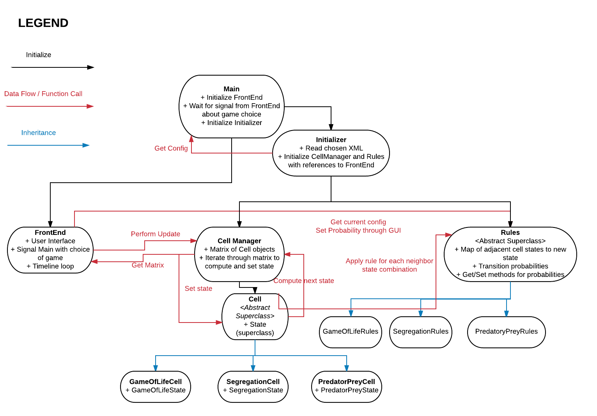
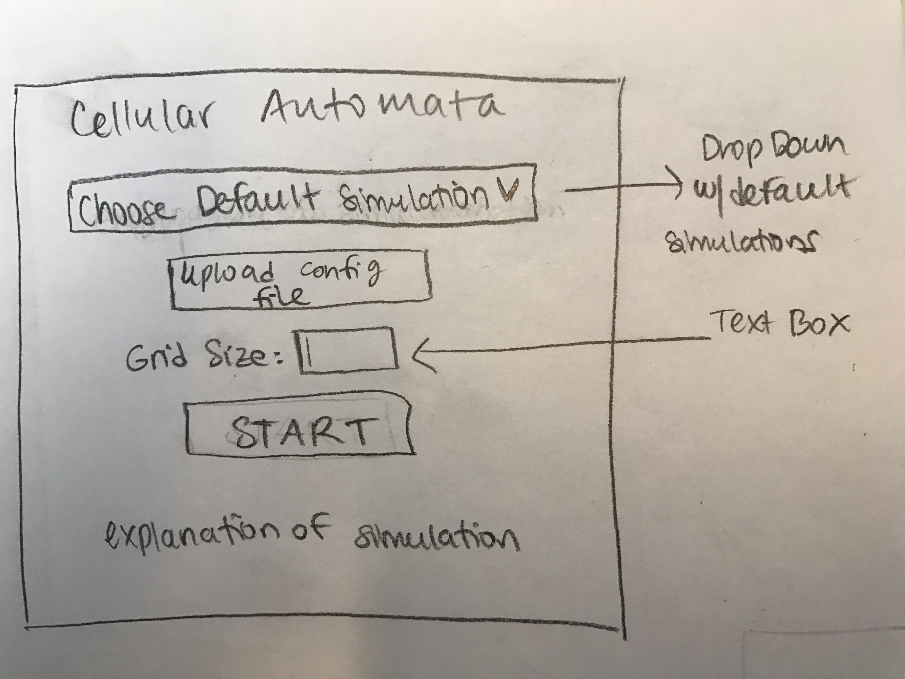

##**CS 308 Cell Society Design**
======
####Team Members:
* Sam Slack
* Archana
* Adithya
-------

###**Introduction**
This section describes the problem your team is trying to solve by writing this program, the primary design goals of the project (i.e., where is it most flexible), and the primary architecture of the design (i.e., what is closed and what is open). This section should discuss the program at a high-level (i.e., without referencing specific classes, data structures, or code).

This CellSociety project is intended to create a framweork for running Cellular Automata (CA) simulations. The design should be robust enough to quickly implement new CA simulations. Each CA simulation is characterized by a grid of a finite set of Cells possessing different states. Unique rules specify how these Cells change over time, taking into consideration both Cell-specific traits and relationships with neighboring Cells. 

A single XML file will specify the exact nature of the simulation to be run. Individuals can explicitly modify the XML attibutes to change the simulation, or interface directly with a GUI. Benefits of modifying the XML directly are that specific simulation states can be saved and compared. 

The overarching design architecture consists of initially reading in the XML file to specify certain front end and back end conditions. The back end will control the logic occuring between successive iterations of the game loop, and will relate this information to the front end by means of a central interface. The front end will control the visual display and hadnle user input.

###**Overview**
The program consists of 6 main components. They are as follows:
* Main
* Initializer
* FrontEnd
* Rules
* CellManager
* Cell

_Main_ is the top-level class that will be run. Its job is to firstly launch the _FrontEnd_ component whose role is described next, and wait on a signal from the FrontEnd as to which game has been selected. Once this signal is received, it proceeds to initialize the Initializer with the XML file name corresponding to the chosen game, as well as a reference to the FrontEnd component. 

Initializer takes the name of an XML config file and a reference to a _FrontEnd_ as initializing arguments, proceeding to parse the XML file (after asserting the file exists and corresponds to a valid game). The retrieved config is then used to initialize an appropriate sub-class of _Rules_ and _CellManager_ with a reference to _FrontEnd_.

_FrontEnd_ is in charge of both displaying / updating the GUI and handling user inputs (button presses, file uploads, key inputs for change of config, etc). The main update loop of the _FrontEnd_ calls the _CellManager.performUpdate(int steps)_ public method of _CellManager_ (described further soon) to progress the simulation. User inputs would be handled by calling the _Rules.setConfig(String key, String value)_ public method on the _Rules_ class.

_Rules_ embodies the logic of state transitions, both on general and game-specific levels. It is an abstract superclass that will be extended by game-specific sub-classes. It stores most of the config read from the XML other than the actual cell matrix. The _Cell_ component calls the _Rules.applyRule(Cell current, Cell neighbor)_ method and / or _Rules.applyRule(Cell current, List<Cell> neighbors)_ method of the _Rules_ class to retrieve a new _State_ result, which is returned to the _CellManager_. 

_CellManager_ holds a reference to the matrix of Cells (_Cell[][] matrix_) which it only exposes through a public API method _getMatrix()_. This matrix is initialized either during the initialization of _CellManager_ or through a _setMatrix(Cel[][] matrix)_ method. Its _performUpdate(int steps)_ method performs each step in 2 parts. Firstly, it iterates through every _Cell_ in the current matrix, computing its next state by calling _Cell.computeState(List<Cell> neighbors, Rules rules)_ on each _Cell_. These results are saved in a local matrix, _State[][] newResults_. Then, it iterates through every _Cell_, calling _Cell.setState(State newState)_ based on the new results computed above.

_Cell_ represents a single cell of Cell Society, regardless of the game. It is an abstract superclass that is extended by game-specific _Cell_ types. At minimum, it stores its current _State_, the exact type and value depending on the game type. It may also hold other information such as color through its instance variables. Its _computeState(List<Cell> neighbors, Rules rules)_ method iterates through each neighbor, passing its own _State_ and neighbor's _State_ to the rules instance to derive its new state. This state is then returned to the caller. The _State_ of the cell can be retrieved and updated through _getState()_ and _setState(State state)_ methods.

These relationships are summarized in the below UML diagram.

__UML Diagram__

 

###**User Interface**
All the text for the user interface will come from a text file.  This text information will be read out and stored by a class separate from main.

####Start and Configuration
The program will begin with a screen that displays an explanation of the simulation and the use of it.  This screen will have a button that allows the user to upload an XML configuration file.  Once it is uploaded, the user can input the grid's desired size in a text box, and then click a "Start" button.  The "Start" button will not do anything if it is clicked at there is no file uploaded.

####Run Simulation
The "Start" button will create a new page where the initial grid will be displayed.  The user will be prompted to press the spacebar in order to begin the simulation.  On this same page, there will be a small panel in a corner with buttons that allow the user to pause and resume the simulation, and fast-forward and slow-down the simulation.  There will be additional buttons that allow the user to move forward by 10 generations automatically.

The panel will also have an option to upload a new configuration file.  If the user clicks on this, then the simulation will stop, the user will have to input the new simulation's desired grid size, and then click a "Start" button again in order to begin the new simulation.

####Catching Errors
If the user inputs a configuration file that doesn't match the needed input, the program will create a pop-up error message that will tell the user that the chosen file is not in the right format and to upload a new one.  If the user inputs words instead of numbers into the grid size box, they will be prompted to input a number.

These images show our basic UI designs.

###**Design Details**

This section describes each component introduced in the Overview in detail (as well as any other sub-components that may be needed but are not significant to include in a high-level description of the program). It should describe how each component handles specific features given in the assignment specification, what resources it might use, how it collaborates with other components, and how each could be extended to include additional requirements (from the assignment specification or discussed by your team). Include the steps needed to complete the Use Cases below to help make your descriptions more concrete. Finally, justify the decision to create each component with respect to the design's key goals, principles, and abstractions. This section should go into as much detail as necessary to cover all your team wants to say.

The entry point into our program is in the `main()` method. This method will immediately contruct a new instance of the `FrontEnd` class. Initially, a GUI will appear to allow the user to choose basic setup requirements, such as the specific CA simulation to run and the size of the simulation's window. Once the user has selected the setup criteria, the `main()` method will will call an `initializer()` that identifies the XML file associated with the user-selected simulation. The `initializer()` will read this file and subsequently establish the rules and Cell types to implement. The front end will update the display to the simulation's initial status, and the game loop will be entered.

FrontEnd: 

Rules:

There is a superclass `Rules()` that controls the general behavior consistent among rules of all simulations. Simulation specififc rules are contained in extended subclasses. The `initializer()` will create an instance of the necessary Rules subclass for the user-chosen simulation. 

The function of each Rules() class is to take in a Collection of a Cell under consideration and a Cell's neighbors (note that neighbors can be defined in any way desired), and return the new state of the Cell under consideration. The rules of each simulation are coded prior to running the program, but specific values that change the functionality of the rules will be determined directly from the XML file or from user input. This will be accomplished by creating a Map from all possible rule variables to their values. The `initialize()` will construct a new Rules() instance using this Map. The FrontEnd class can get the full map from the Rules, and can set individual {key, val} pairs. 

CellManager:

Cell:

construct a new XMLParser() instance to process the 
construct new instance of the `FrontEnd()` class. 

main
xmlparser
frontend
cellmanager
rules

###**Team Responsibilities**

####Adithya:
Front-end piece -- creating the user interface and taking in user input.

####Sam:
Back-end piece -- creating all the methods and logic behind the Rules class.

####Archana:
Interface between front-end and back-end -- creating cells, the cellManager, and reading XML files.

